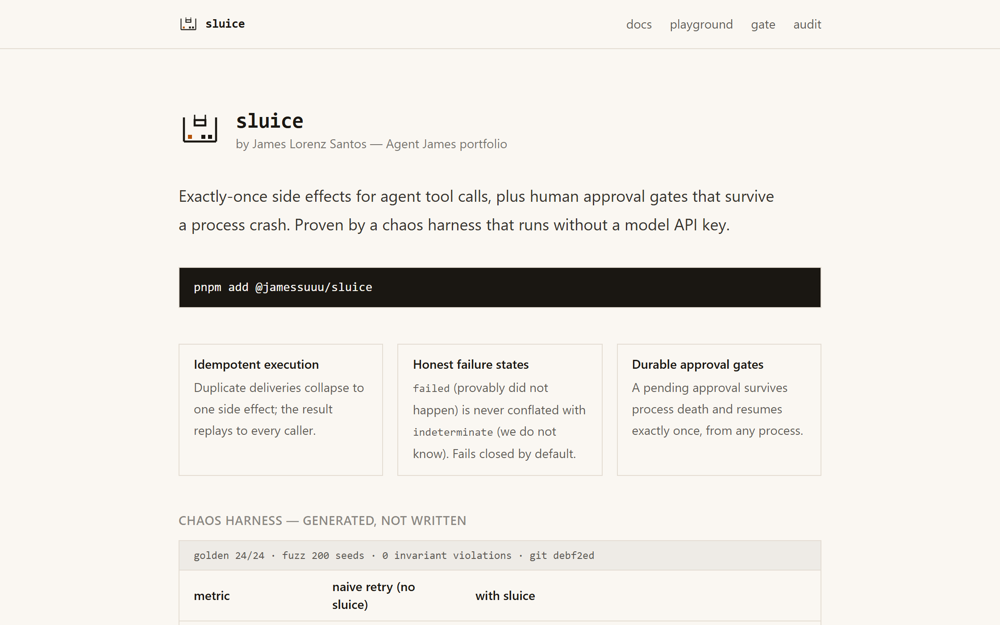

<p align="left">
  
</p>

# sluice

**Exactly-once side effects for agent tool calls, plus human approval gates that
survive a process crash. Proven by a chaos harness that runs without a model API key.**

> **Status: `1.0.0-rc.1` — the v1 consumer contract is frozen.** All nine build
> milestones (SPEC §10) are complete and gate-green. Docs, playground, and gate
> walkthrough: [sluice-iota.vercel.app](https://sluice-iota.vercel.app) (`apps/web`,
> SPEC §9 — zero API routes, zero database, zero writes; the playground/gate pages
> run this exact core, client-side, in a Web Worker).

<!-- chaos:begin -->
**Chaos harness** — `golden 24/24 · fuzz 200 seeds · 0 invariant violations`

| metric | naive retry (no sluice) | with sluice |
|---|---|---|
| intent success rate | 100.0% | 77.0% (20.0% fail closed — parked `indeterminate`, never silent) |
| duplicate side effects | **666** | **0** |

Baseline workload: 200 intents delivered 2–5× each under 30.0% injected failure (15.0% errors + 15.0% landed-but-timed-out).
Retry amplification under 30.0% injected failure: **0.88×** downstream attempts per intent (CI gate ≤ 1.5).
`run()` latency under fault injection: p50 0 ms · p99 60,000 ms — **virtual clock time, not wall clock**.
Run shape: 9 scenarios × 10 seeds · 740 intents · 1,014 deliveries · git `debf2ed`.
Regenerate with `pnpm chaos` — full tables in [chaos/RESULTS.md](chaos/RESULTS.md).
<!-- chaos:end -->

[](https://sluice-iota.vercel.app/#durable-approval-gates)

GitHub will not autoplay the recording reliably, so this links to the live
page instead — click through to watch it, or try the walkthrough yourself at
[sluice-iota.vercel.app/gate](https://sluice-iota.vercel.app/gate) (under 30
seconds, survives a real page reload).


## Install

```bash
pnpm add @jamessuuu/sluice
# optional: a Postgres store for production, and the chaos harness for your own tests
pnpm add @jamessuuu/sluice-store-postgres
pnpm add -D @jamessuuu/sluice-testkit
```

```ts
import { createSluice, idempotencyKey, MemoryStore } from "@jamessuuu/sluice";

const sluice = createSluice({ store: new MemoryStore() });

const first = await sluice.run(
  { key: idempotencyKey({ tool: "send_email", to: "a@b.c" }) },
  async () => sendEmail("a@b.c")
);
// first.status === "executed" — the email went out once.

const again = await sluice.run(
  { key: idempotencyKey({ tool: "send_email", to: "a@b.c" }) },
  async () => sendEmail("a@b.c")
);
// again.status === "replayed" — sendEmail did NOT run a second time;
// again.value is the recorded result from the first call.
```

Full walkthrough: [docs/quickstart](https://sluice-iota.vercel.app/docs/quickstart).
The concept behind it — why `failed` and `indeterminate` are two different
states, not one — is [docs/concepts](https://sluice-iota.vercel.app/docs/concepts).

## Why

Agents retry. Transports redeliver. Processes crash mid-call. When the tool call is
`send_email` or `create_charge`, "at-least-once" is an incident. sluice wraps
side-effecting tool calls in:

- **Idempotent execution** — duplicate deliveries collapse to one side effect,
  with the result replayed to every caller.
- **Honest failure states** — `failed` (provably did not happen) is not the same
  state as `indeterminate` (we do not know). sluice refuses to collapse them, and
  fails closed on indeterminate by default.
- **Durable human approval gates** — a pending approval survives process death and
  resumes exactly once, from any process.
- **A tamper-evident audit trail** — hash-chained events, verifiable offline.

Zero runtime dependencies. No LLM anywhere. No telemetry.

## Monorepo

| Package | Purpose |
|---|---|
| `@jamessuuu/sluice` | Core: effects, gates, audit. Zero deps. |
| `@jamessuuu/sluice-store-postgres` | Neon/Postgres store (Drizzle, forward-only migrations). |
| `@jamessuuu/sluice-testkit` | Deterministic chaos harness + store conformance suite. |

The npm scope is `@jamessuuu` because the unscoped name is an abandoned 2013
package; the CLI binary and this repo are the identity.

## CLI

```bash
sluice gates ls [--namespace <ns>] [--status <status>] [--state <path>]
sluice gates show <id> [--state <path>]
sluice gates approve <id> [--by <name>] [--reason <text>] [--state <path>]
sluice gates reject <id> [--by <name>] [--reason <text>] [--state <path>]
sluice chaos --seed <n>
```

`gates` operates against a local JSON `MemoryStore` snapshot (`.sluice/state.json`
by default) — the CLI's ephemeral mode for local dogfooding and demos, not a
production Postgres connection (point your own script at your own store for
that). `chaos` runs the [chaos harness](https://sluice-iota.vercel.app/docs/chaos-harness)
(numbers below) for one seed; it dynamically imports `@jamessuuu/sluice-testkit`
so the zero-runtime-dependency core never depends on it.

## Failure modes

Every row is asserted by a chaos scenario and a golden fixture — see
[docs/failure-modes](https://sluice-iota.vercel.app/docs/failure-modes) for the full
prose. `SluiceError` always carries `{ code, retryable, indeterminate, context }`
— never a stack, never a driver string.

| # | Fault | Contract |
|---|---|---|
| F1 | Duplicate delivery (2–5×, concurrent) | Exactly one claim wins; losers replay the winner's outcome. Ledger count is 1. |
| F2 | Timeout, effect landed anyway | Classified `indeterminate`; fails closed by default (`E_INDETERMINATE`), never reported as success, never auto-retried. |
| F3 | Crash after the side effect, before the result was persisted | Lease expires; the next claim transitions it to `indeterminate` — never a silent re-claim. |
| F4 | Crash before the side effect | Same `indeterminate` transition — indistinguishable from F3 by design; `'fail'` is the default for exactly this reason. |
| F5 | Crash mid-gate | The gate row is durable; resumption via `claimDecided` runs post-decision work through `run()` — exactly-once. |
| F6 | Double decision / approve-reject race | First writer wins; the second call returns the recorded decision (idempotent, not an error). |
| F7 | Retry storm | Retry budget (10%) + full-jitter backoff + circuit breaker; exhaustion is an immediate `E_RETRY_BUDGET`. |
| F8 | Clock skew between workers | No double execution within `leaseMs / 2`; beyond it, fails closed to `indeterminate` rather than risk a double execution. |
| F9 | Key reuse with different arguments | `fingerprint` mismatch throws `E_KEY_CONFLICT` — never a silent wrong-result replay. |
| F10 | Result too large (> `maxResultBytes`) | Stored as `resultOmitted`; the type forces every caller to handle it. |
| F11 | Store unavailable | `E_STORE`; `indeterminate` if after the claim, `retryable` if before. The effect function never runs without a granted claim. |
| F12 | Gate timeout | `sweepTimeouts` (and any read of an expired gate) resolves it to `timed_out`, applying `onTimeout` (default `reject`). |

## Non-goals

No domain logic (no senders, schedulers, incident models). No LLM calls. No
policy DSL / content guardrails. Not a workflow engine — sluice runs *inside*
one step of yours. No telemetry, ever.

## Limitations

- **ESM-only, Node ≥ 22.** No CommonJS build.
- **TTL is a memory horizon, not a correctness knob.** Set `retentionMs` longer
  than the longest realistic duplicate-delivery window; after expiry the same
  key executes again.
- **Hash-chain append throughput ceiling:** roughly hundreds of events/sec per
  namespace on Postgres (a cursor row lock serializes appends) — audit-grade
  volume, not a general event bus. Use more namespaces for more throughput.
- **Circuit breaker is eventually consistent across instances** — read-through
  cached 1s in-process; half-open's single-probe admission stays correctly
  serialized regardless (a CAS write), only the state-change *notice* lags.
- **Clock-skew ceiling:** no double execution within `leaseMs / 2` skew; beyond
  that, sluice fails closed rather than risk one (F8).
- **Chaos numbers are virtual-clock time, not wall-clock time** — the harness's
  published p50/p99 describe scheduling behaviour under a `VirtualClock`, not
  real network/database I/O.

Full detail: [docs/limitations](https://sluice-iota.vercel.app/docs/limitations).

---

Part of the [Agent James](https://agentjames.vercel.app) portfolio.
Built by James Lorenz Santos. Code MIT; brand assets excluded (see LICENSE).
